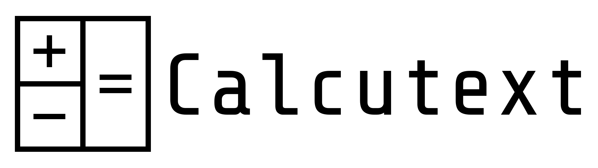
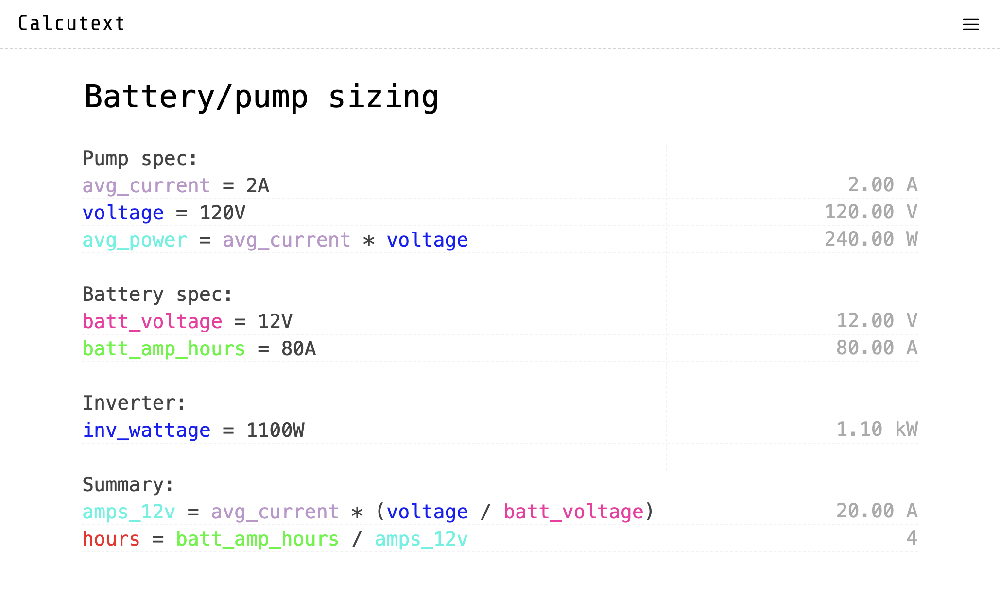

https://calcutext.com

> Calcutext is a web app where you can do calculations with your written text.



## Features

- Write any math operations, as available in [mathjs](https://github.com/josdejong/mathjs), as a series of written lines to make notes and do calculations
- Locally-stored/switchable/manageable list of texts
- Locally-stored settings
- Ultra-lightweight and fast


## Develop

Clone the repo, then

```
npm install
```

and

```
npm run dev
```

Then visit http://localhost:3000/
